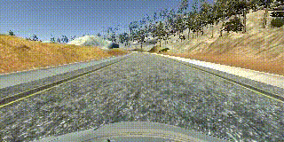
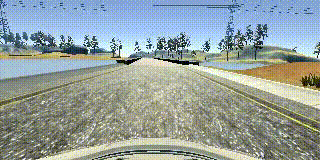
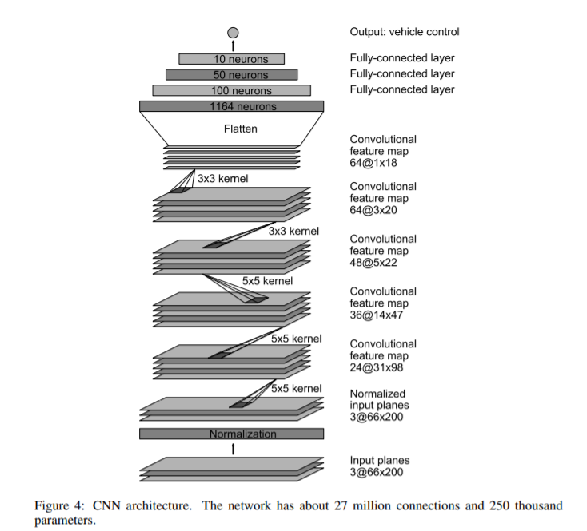
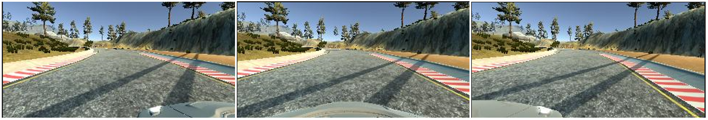

# CarND-pj4_Behavioral_Cloning
### Udacity Self-Driving Car Engineer - Project4: Behavioral Cloning (Computer Vision | Deep Learning: end-to-end convolutional networks)

[](http://www.udacity.com/drive)

<!-- ======================================================
Overview
---

You will train, validate and test a model using Keras. The model will output a steering angle to an autonomous vehicle.

We have provided a simulator where you can steer a car around a track for data collection. You'll use image data and steering angles to train a neural network and then use this model to drive the car autonomously around the track.


The Project
---
The goals / steps of this project are the following:
* Use the simulator to collect data of good driving behavior 
* Design, train and validate a model that predicts a steering angle from image data
* Use the model to drive the vehicle autonomously around the first track in the simulator. The vehicle should remain on the road for an entire loop around the track.
* Summarize the results with a written report
====================================================== -->

In this project the following tasks were developed:
* Use the simulator to collect data of good driving behavior.
* Build a convolution neural network in Keras that predicts steering angles from images.
* Train and validate the model with a training and validation datasets.
* Test that the model successfully drives around track one without leaving the road in the simulator.

Here are some results of my project:

<p align="center" float="left" justify-content="center">
    
    
</p>
<p align="center" float="left" justify-content="center">
    
    
</p>
<p align="center" float="left" justify-content="center">
    
    
</p>

[//]: # (Image References)

[image1]: ./examples/nvidia-net.png "Nvidia Net"
[image2]: ./examples/sides_image.png "Side Images"


---
### Files Submitted & Code Quality

#### 1. Submission includes all required files and can be used to run the simulator in autonomous mode

My project includes the following files:
* model.ipynb containing the script to create and train the model.
* model.h5 containing a trained convolution neural network.
* drive.py for driving the car in autonomous mode.
* video.py for recording the simulation. 


### Dependencies
This lab requires:

* The lab enviroment can be created with [CarND Term1 Starter Kit](https://github.com/udacity/CarND-Term1-Starter-Kit).

* The simulator can be downloaded from [here](https://github.com/udacity/self-driving-car-sim).

* Install:
```sh
pip install python-socketio==4.6.0
pip install python-engineio==3.13.0
```

### Driving and recording
Once the model has been saved in an `.h5` file, it can be used to control the vehicle with drive.py using this command:
```sh
python drive.py model.h5
```
The fourth argument, `run1`, is the directory in which to save the images seen by the agent. If the directory already exists, it'll be overwritten.

```sh
python drive.py model.h5 run1
```
The above command will load the trained model and use the model to make predictions on individual images in real-time and send the predicted angle back to the server via a websocket connection.

Note: There is known local system's setting issue with replacing "," with "." when using drive.py. When this happens it can make predicted steering values clipped to max/min values. If this occurs, a known fix for this is to add "export LANG=en_US.utf8" to the bashrc file.

The image file name is a timestamp of when the image was seen. 

```sh
ls run1

[2017-01-09 16:10:23 EST]  12KiB 2017_01_09_21_10_23_424.jpg
[2017-01-09 16:10:23 EST]  12KiB 2017_01_09_21_10_23_451.jpg
[2017-01-09 16:10:23 EST]  12KiB 2017_01_09_21_10_23_477.jpg
[2017-01-09 16:10:23 EST]  12KiB 2017_01_09_21_10_23_528.jpg
...
```
This information is used by `video.py` to create a chronological video of the agent driving.

```sh
python video.py run1
```

The above command creates a video based on images found in the `run1` directory. The name of the video will be the name of the directory followed by `'.mp4'`, so, in this case the video will be `run1.mp4`.

Optionally, one can specify the FPS (frames per second) of the video:

```sh
python video.py run1 --fps 48
```

It will run the video at 48 FPS. The default FPS is 60.


The model.ipynb file contains the code for training the convolution neural network and saving the model. The file shows the pipeline that I used for training and validating the model, and it contains comments to explain how the code works.

## Model Architecture and Training Strategy

My model is based on [Nvidia End to End Learning for Self-Driving Cars](https://images.nvidia.com/content/tegra/automotive/images/2016/solutions/pdf/end-to-end-dl-using-px.pdf) architecture. I thought this architecture might be appropriate because it has been proven to work in real life and because of its size it is suitable for real-time applications. The architecture is showing in the following image:

<p align="center"></p>

The model includes RELU activation functions to introduce nonlinearity. The data is preprocessed in the first two layers. First I apply a crop over the image to get an interesting area:
```sh
 model.add(Cropping2D(cropping=((60,20), (0,0)), input_shape=(160,320,3)))
```
Then normalize the data to a value in the range [-1,1]:
```sh
model.add(Lambda(lambda x: x/127.5 - 1.))
```

The model also contains dropout layers in order to reduce overfitting. The activation rate is set in 0.5.


#### 3. Appropriate training data

The model used an adam optimizer and the batch size is set to 256.

I use different set of training data:
    - Record driving clockwise
    - Record driving counterclockwise
    - Record recovering from the left and right sides
    - Record recovering from the left and right curves
    - Added udacity data to expand the dataset

Total data was: 42927 images.

BALANCED DATA (histogram with a lot 0 in steer angle)

### Model Architecture and Training Strategy

#### 1. Solution Design Approach

In order to gauge how well the model was working, I split my image and steering angle data into a training and validation set. I started testing with just my records driving normally clockwise and counter clockwise. It worked when the car was in the center of the lane, but he doesn't know how to recover when he gets close to the sidelines.

Then I added recovery data and udacity to expand a dataset and the behavior improved a lot. I found that my first model had a low mean squared error on the training set but a high mean squared error on the validation set. This implied that the model was overfitting. To combat the overfitting, I modified the model added dropout layers.


## 2. Data augmentation

I use sides images recorded in every test to augment the dataset. I modified the angle for these images by adding a correction factor of 0.25. Here is an example of how it looks:

<p align="center"></p>

I also flipped half of images and angles thinking that this would balance the data between lines on the left and right side. Moreover I changed the contrast of half the images to help to generalize the model. The data set is randomly shuffled after each itration.