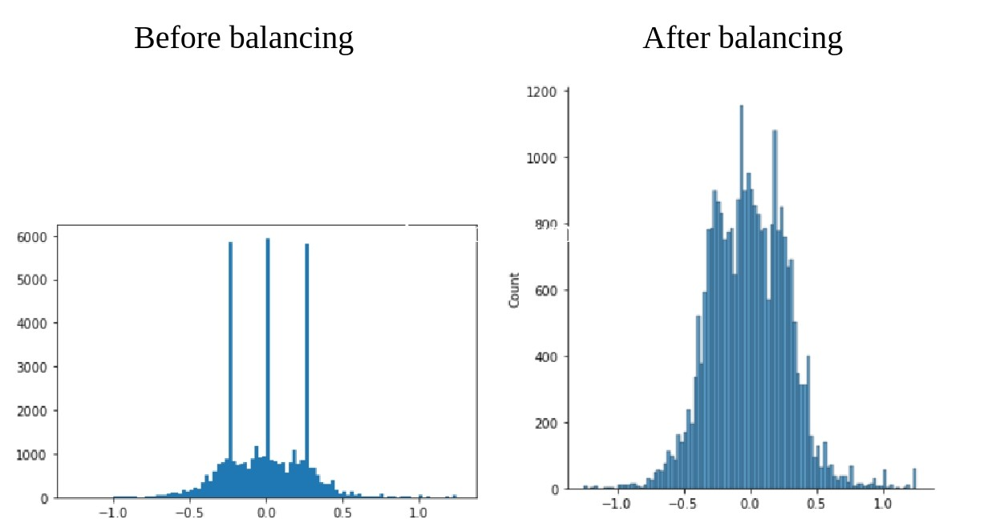
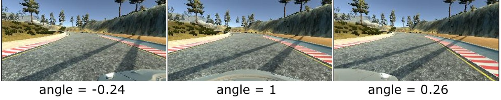

# CarND-pj4_Behavioral_Cloning
### Udacity Self-Driving Car Engineer - Project4: Behavioral Cloning (Computer Vision | Deep Learning: end-to-end convolutional networks)

[](http://www.udacity.com/drive)

In this project the following tasks were developed:
* Use the simulator to collect data of good driving behavior.
* Build a convolution neural network in Keras that predicts steering angles from images.
* Train and validate the model with a training and validation datasets.
* Test that the model successfully drives around track one without leaving the road in the simulator.

A simulator was provided in which it was possible to drive a car on a track to collect data. The image data and steering angles were used to train a neural network and generated a model capable of driving the car autonomously around the track. 

Here are some results of my project:

<p align="center" float="left" justify-content="center">
    
    
</p>
<p align="center" float="left" justify-content="center">
    
    
</p>
<p align="center" float="left" justify-content="center">
    
    
</p>


## Files Description

My project includes the following files:
* Behavioral-Cloning.ipynb containing the script to create and train the model.
* model.h5 containing a trained convolution neural network.
* drive.py for driving the car in autonomous mode.
* video.py for recording the simulation. 

## Dependencies
This lab requires:

* The lab enviroment can be created with [CarND Term1 Starter Kit](https://github.com/udacity/CarND-Term1-Starter-Kit).

* The simulator can be downloaded from [here](https://github.com/udacity/self-driving-car-sim).

* Install:
```sh
pip install python-socketio==4.6.0
pip install python-engineio==3.13.0
```

## Driving and recording

Once the model has been saved in an `.h5` file, it can be used to control the vehicle with drive.py using this command:
```sh
python drive.py model.h5
```
The above command will load the trained model and use the model to make predictions on individual images in real-time and send the predicted angle back to the server via a websocket connection. You can pass a fourth argument (`run1`) that is the directory in which the images seen by the car are stored. If the directory already exists, it'll be overwritten.

```sh
python drive.py model.h5 run1
```


The image file name is a timestamp of when the image was seen. 

```sh
ls run1

[2017-01-09 16:10:23 EST]  12KiB 2017_01_09_21_10_23_424.jpg
[2017-01-09 16:10:23 EST]  12KiB 2017_01_09_21_10_23_451.jpg
[2017-01-09 16:10:23 EST]  12KiB 2017_01_09_21_10_23_477.jpg
[2017-01-09 16:10:23 EST]  12KiB 2017_01_09_21_10_23_528.jpg
...
```
This information is used by `video.py` to create a chronological video of the agent driving.

```sh
python video.py run1
```

The above command creates a video based on images found in the `run1` directory. The name of the video will be the name of the directory followed by `'.mp4'`, so, in this case the video will be `run1.mp4`.

Optionally, one can specify the FPS (frames per second) of the video:

```sh
python video.py run1 --fps 48
```

It will run the video at 48 FPS. The default FPS is 60.


Note: There is known local system's setting issue with replacing "," with "." when using drive.py. When this happens it can make predicted steering values clipped to max/min values. If this occurs, a known fix for this is to add "export LANG=en_US.utf8" to the bashrc file.


## Model Architecture and Training Strategy

The Behavioral-Cloning.ipynb file contains the code for training the convolution neural network and saving the model. The file shows the pipeline that I used for training and validating the model, and it contains comments to explain how the code works.

### Model

My model is based on [Nvidia End to End Learning for Self-Driving Cars](https://images.nvidia.com/content/tegra/automotive/images/2016/solutions/pdf/end-to-end-dl-using-px.pdf) architecture. I thought this architecture might be appropriate because it has been used to work in real life and its size is suitable for real-time applications. The architecture is showing in the following image:

<p align="center"></p>

The model includes RELU activation functions to introduce nonlinearity. The data is preprocessed in the first two layers. First I apply a crop over the image to get an interesting area:

```sh
 model.add(Cropping2D(cropping=((60,20), (0,0)), input_shape=(160,320,3)))
```
Then normalize the data to a value in the range [-1,1]:
```sh
model.add(Lambda(lambda x: x/127.5 - 1.))
```
The model also contains dropout layers in order to reduce overfitting. The activation rate is set in 0.5.


### Appropriate training data

The model used an Adam optimizer and the batch size is set to 256.

I used different set of training data:
* Record driving clockwise
* Record driving counterclockwise
* Record recovering from the left and right sides
* Record recovering from the left and right curves
* Added udacity data to expand the dataset

Total data: 42927 images.

Note: I did not include data in this repository due to storage size.

On the other hand, if the simulator is controlled with the keyboard (instead of the mouse), the steering angles are discrete, and take one of these 3 possible values: `[-0.25,0,0.25]`. It produces an imbalance of data. So, I decided to balance the data by croping the majority data and normalizing the histogram.


<p align="center"></p>

### Data augmentation

* I use sides images recorded in every test to augment the dataset. I modified the angle for these images by adding a correction factor of 0.25. Here is an example of how it looks:

<p align="center"></p>

* I flipped half of the images and angles. It would balance the data between lines on the left and right side. 
* I changed the contrast of half the images to help to generalize the model. 
* Bear in mind that the data set is randomly shuffled after each itration.
